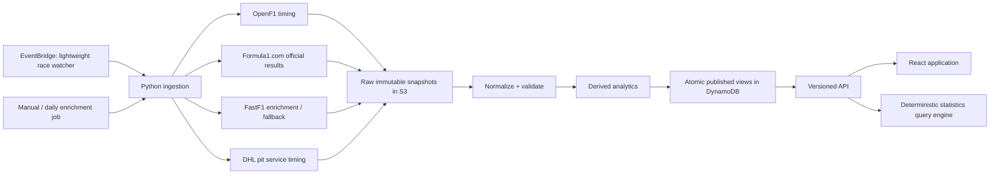

# Slipstream full-site rebuild blueprint

Status: architecture and design gate  
Date: 2026-07-27  
Scope: every public route, the shared frontend system, ingestion, publishing, observability, responsive behavior, and the deterministic statistics search

## Executive decision

Slipstream should receive a full product rebuild, not another Race Story patch.

The recommended shape is:

- Keep React, but migrate the rebuilt surface to TypeScript.
- Do not adopt a general-purpose UI library.
- Build a small internal design system in semantic HTML, CSS Modules, CSS custom properties, and a deliberately limited set of React primitives.
- Consolidate ingestion and analytics in Python, where the motorsport data tooling already lives.
- Use OpenF1 as the primary post-race timing source, official Formula 1 results as the classification authority, and FastF1 as enrichment/fallback rather than the single publication gate.
- Keep the existing Netlify, S3, DynamoDB, Lambda, and API Gateway footprint. Add scheduling and status records, not a new platform.
- Publish every race progressively: classification first, detailed story when timing is ready, enrichment later.
- Make freshness and source provenance visible in the interface.
- Keep the statistics search deterministic, auditable, and free of metered model dependencies.

This is a replacement architecture delivered incrementally behind the existing site. It is not a big-bang rewrite.

## Why this needs to be site-wide

The current application has individually capable pages, but it does not behave like one coherent product.

### Production observations

The production audit found:

| Surface | Observed state | Product consequence |
| --- | --- | --- |
| 2026 driver standings | Includes Spa and displays the current championship | The season source knows Spa happened |
| 2026 Race Story | Defaults to Belgium/Spa but shows “timing pending” | The most visible narrative surface contradicts the rest of the product |
| Sector Analysis | Still says “Loading latest sector data...” after six seconds, with no error or recovery path | A user cannot distinguish slow, unavailable, or broken data |
| Race Story route | Hard-coded to `/2026/race-story` | The page cannot become a durable multi-season race archive |
| Data refresh workflow | FastF1 failure is logged but the process exits successfully in season-only mode | Automation reports green while the main deliverable remains unpublished |
| Data sources | OpenF1 is not used | A currently available source of post-race laps, positions, pits, and overtakes is ignored |

### Responsive observations

At a 390 × 844 viewport, the site avoids body-level horizontal overflow, which is worth preserving. The content model, however, becomes a long stack rather than a deliberately composed mobile experience:

| Route | Approximate rendered page height |
| --- | ---: |
| Home | 3,411 px |
| Driver standings | 905 px |
| Race results | 1,329 px |
| Driver statistics | 8,120 px |
| Head-to-head | 6,932 px |
| Pit-stop analysis | 3,487 px |
| About | 2,381 px |

The mobile Driver Statistics first view is dominated by three selects, two switches, and four disconnected metric cards. The Race Story first view is almost entirely an empty pending state. Those are information-architecture problems, not breakpoint bugs.

### Frontend observations

- Roughly 14,000 lines of UI code are spread across global CSS, page CSS, components, and page-local styling.
- `src/index.css` is more than 1,200 lines and carries page-level, component-level, and global concerns.
- Several pages contain 50–80 inline style objects.
- The shared maximum width, spacing, loading, empty, error, filtering, and chart behaviors are not expressed as one page framework.
- Most routes independently request the same large season record, then transform it in the browser.
- Mobile navigation is controlled partly through `window.innerWidth`, even when CSS should own the layout.
- Race Story supports only 2026 while most other analysis routes support 2025 and 2026.
- Dense desktop tables are often converted into a full card per row on mobile, producing the 7,000–8,000 px waterfalls.

### Build baseline

The current production build succeeds and all 33 server tests pass. That gives the rebuild a stable comparison point.

The current build also shows why route budgets are necessary:

- shared application JavaScript: 80.59 kB gzip
- shared chart code: 66.72 kB gzip
- Pit Stop route: 353.93 kB raw / 41.04 kB gzip

The rebuild should preserve code splitting while making data delivery and route ownership more explicit.

## Product model

Slipstream should feel like an independent motorsport analysis desk: editorial enough to tell a race story, technical enough to support investigation, and fast enough to consult during a conversation.

The visual concept is **the pit wall, edited**:

- a clear live status rail instead of generic dashboard tiles
- timing-tower density where rank and interval matter
- editorial hierarchy where a story matters
- restrained team color used as data, not decoration
- source and freshness stamps treated as part of the product
- charts used only when shape, movement, or comparison is easier to understand visually

The site should not imitate the official F1 broadcast package. Slipstream needs its own recognizable language.

## Information architecture

### Primary navigation

1. Season
2. Races
3. Championships
4. Drivers
5. Compare
6. Technical
7. Search

Methodology, data sources, about, accessibility, and legal information live in the footer and remain directly addressable.

### Target routes

| New route | Purpose | Legacy route treatment |
| --- | --- | --- |
| `/:season` | Live season desk | Home and season-aware entry point |
| `/:season/races` | Calendar and race archive | New |
| `/:season/races/:round` | Complete race dossier | Redirect `/:season/race-story` |
| `/:season/standings/drivers` | Driver championship | Redirect `/:season/drivers` |
| `/:season/standings/constructors` | Constructor championship | Redirect `/:season/constructors` |
| `/:season/results` | Compact season results matrix | Redirect `/:season/driver-results` |
| `/:season/drivers` | Driver directory | New semantic meaning |
| `/:season/drivers/:driverId` | Driver profile and form | New |
| `/:season/compare` | Driver/team comparison workspace | Redirect `/:season/head-to-head` |
| `/:season/pace` | Sector and pace lab | Redirect `/:season/sector-analysis` |
| `/:season/pit-lane` | Pit service, lane loss, and strategy | Redirect `/:season/pit-stop-analysis` |
| `/methodology` | Sources, calculations, freshness, limitations | Expand `/about` |

All old indexable paths receive permanent redirects after the new routes pass production acceptance.

## Shared visual system

Avoiding a UI library is the right choice if the replacement is a disciplined internal system.

### Foundations

- Use CSS custom properties for color, type, space, elevation, border, motion, and chart constants.
- Use CSS Modules for component ownership.
- Use cascade layers: `reset`, `tokens`, `base`, `primitives`, `layouts`, `utilities`, `overrides`.
- Keep one global stylesheet for reset, tokens, typography, and truly global behavior only.
- Use fluid type and spacing with `clamp()`.
- Use container queries for page modules; reserve JavaScript media queries for cases where a chart must change its data density.
- Default radius should be restrained. The product should not become a collection of rounded cards.

Suggested base palette:

| Token | Role |
| --- | --- |
| `--ink-0: #F5F7F9` | primary text |
| `--ink-2: #A8B0BC` | secondary text |
| `--track-0: #080A0E` | page background |
| `--track-1: #0E1218` | raised working surface |
| `--track-2: #171C24` | selected/interactive surface |
| `--line: #2A313C` | separators |
| `--signal: #FF514A` | Slipstream action/status accent |
| `--telemetry: #58D3C4` | comparison/data accent |
| team tokens | actual team identity in charts and signatures |

Team colors are categorical data and must not be reused as generic success/error colors.

### Internal primitives

The rebuilt site needs a deliberately small vocabulary:

- `AppShell`
- `GlobalHeader`
- `SeasonRail`
- `PageHeader`
- `DataStatus`
- `FreshnessStamp`
- `SourceStamp`
- `FilterBar`
- `SegmentedControl`
- `MetricStrip`
- `TimingTower`
- `DriverSignature`
- `TeamSignature`
- `Delta`
- `ChartFrame`
- `DataTable`
- `MobileDataList`
- `Disclosure`
- `EmptyState`
- `ErrorState`
- `LoadingFrame`
- `QueryComposer`

Every primitive owns:

- keyboard and screen-reader behavior
- focus treatment
- loading, empty, stale, disabled, and error states
- density options
- phone, tablet, and desktop behavior
- test identifiers only where behavior needs them

No page should create its own button, select, status badge, card, or loading treatment.

### Motion

- Use motion to explain state change: ranking movement, updated intervals, disclosure, and route continuity.
- Keep standard transitions at 120–180 ms.
- Never animate an entire long results list on initial load.
- Honor `prefers-reduced-motion`.

## Page-by-page redesign

### Season desk (`/:season`)

The first viewport answers three questions:

1. What just happened?
2. What changed in the championships?
3. What is next?

Structure:

- compact season/race rail
- latest race result and publication status
- championship movers, not complete duplicate standings
- one leading analytical observation with a route into the relevant tool
- next session time and track
- persistent search entry for races, drivers, teams, and tools

The current eleven-team presentation becomes a compact grid reference lower on the page. The current generic feature-card catalog becomes contextual entry points attached to real current-season information.

### Race archive (`/:season/races`)

- chronological calendar with `scheduled`, `live`, `results`, `story ready`, and `degraded` states
- latest completed race at the top on small screens
- filter by completed/upcoming and sprint/non-sprint
- every row shows its source freshness and links to one canonical race dossier

### Race dossier (`/:season/races/:round`)

The existing Race Story becomes a race dossier with progressive publication.

Order:

1. classification and essential race facts
2. “what decided the race” summary derived from published metrics
3. lead and position-change narrative
4. pivotal overtakes
5. strategy and pit cycles
6. pace and traffic
7. attrition
8. full event log on demand
9. source coverage and calculation notes

If detailed timing is pending, the page still publishes classification, grid change, fastest lap, retirements, and official results. It must not collapse into a full-screen dead end.

Large raw lists move behind summaries and disclosures:

- show the pivotal overtakes, then “all overtakes”
- show decisive pit cycles, then “all stops”
- show top traffic effects, then “all traffic”

On phones, the section index becomes a horizontal sticky rail. Tables become dense two-line timing rows, not one large card per record.

### Driver championship

- default to the full timing tower, not only the top five
- allow a compact “movement” mode and a “points” mode
- show gap to leader and gap to next position without requiring a tooltip
- preserve rank movement as the defining visualization
- on phones, the ranking list is primary and the movement chart is an optional full-width detail

### Constructor championship

- use the same championship grammar as drivers
- display both total points and contribution by driver
- allow race-by-race movement without car graphics colliding with chart bounds
- expose scoring-event context on selection

### Season results

- replace chart-first navigation with a compact results matrix
- sticky driver column and race header on wide screens
- density switch for position, points, grid change, and status
- phone view starts with a selected driver and horizontally scrollable race strip

### Driver directory and profile

Directory:

- team-grouped or ranking-grouped driver list
- current points, form, teammate comparison, and latest finish

Profile:

- season summary
- form strip
- qualifying and race comparison to teammate
- points and position trend
- best/worst rounds
- linked race evidence

This absorbs the useful parts of the current Driver Statistics page while eliminating the all-drivers, all-metrics card waterfall.

### Compare

- explicit entity slots at the top
- a compact summary verdict expressed as factual deltas, not generated prose
- qualifying, race, sprint, points, consistency, pace, and reliability sections
- shared race sample and missing-data notes are always visible
- comparison URL is shareable
- phone layout uses one metric row per comparison, not duplicate side-by-side cards

### Pace Lab

- merge sector analysis and the pace portions of other pages
- select race, session, drivers/teams, lap treatment, and metric
- show availability before the visualization mounts
- provide a clear unavailable state with the missing source and next retry time
- keep raw lap/sector tables downloadable or expandable, not permanently in the main reading flow

### Pit Lane

- separate service time, total lane time, and strategic outcome
- label the data source for each metric because the clocks measure different things
- show the field distribution before team rankings
- preserve the existing crew-versus-lane distinction
- use a compact mobile team timing list instead of an 800 px internal table

### Search

- available globally from the header and keyboard shortcuts
- indexes tools immediately and adds published races, drivers, and teams on open
- routes directly to canonical pages without a public write endpoint
- remains deterministic, fast, and free of metered model dependencies

### Methodology

- source catalog and authority rules
- definition of every derived metric
- publication-state explanation
- known gaps
- timestamp and schema version
- contact/correction path

## Responsive and cross-platform contract

The rebuild targets capability and available space, not device names.

### Required test widths

- 320 px: minimum supported phone
- 390 px: representative phone
- 768 px: portrait tablet
- 1024 px: tablet/small laptop
- 1280 px: standard laptop
- 1440 px and 1920 px: wide desktop

### Rules

- no body-level horizontal overflow at any supported width
- minimum 44 × 44 px touch target
- no control row with more than two full-width controls on a phone before progressive disclosure
- no primary reading path longer than roughly three phone viewports without a section index or summary
- charts must have an adjacent text summary and accessible data table or list
- tables may scroll horizontally only when the column relationship is itself the point; otherwise transform the information
- all filters, selected states, and comparisons remain usable by keyboard
- hover is enhancement only
- navigation uses CSS for layout and one accessible disclosure state, not `window.innerWidth`
- support pointer, touch, keyboard, reduced motion, zoom to 200%, and high-contrast preferences

## Target data architecture



### Source authority

| Data | Primary | Fallback/enrichment |
| --- | --- | --- |
| classification, grid, points, status | official Formula 1 results | prior published snapshot, explicitly marked stale |
| laps, positions, intervals, pits, overtakes | OpenF1 post-race endpoints | FastF1 |
| telemetry-derived enrichment | FastF1 | unavailable without blocking classification |
| pit service timing | DHL timing | Formula 1 pit-lane time, with distinct labeling |

No one enrichment source may prevent a valid official classification from publishing.

### Pipeline states

Every season and race gets an explicit state record:

- `scheduled`
- `awaiting_results`
- `results_ready`
- `awaiting_timing`
- `timing_ready`
- `published`
- `degraded`
- `failed`

Each record contains:

- `lastAttemptAt`
- `nextAttemptAt`
- `publishedAt`
- `sourceCoverage`
- `missingCapabilities`
- `schemaVersion`
- `contentVersion`
- `lastErrorCode`
- `lastErrorSummary`

The UI renders from these states. It never infers publication readiness from a missing array.

### Trigger strategy

1. EventBridge invokes a lightweight watcher every 15 minutes.
2. The watcher exits immediately unless a race falls within an active publication window or an incomplete race is due for retry.
3. After a race, it polls official results and OpenF1 with bounded exponential backoff.
4. As soon as classification is valid, it publishes the partial race dossier.
5. As soon as timing coverage passes validation, it atomically replaces the read model with the full dossier.
6. A daily or manually dispatched GitHub job performs heavier FastF1 enrichment/backfill.
7. Any race remaining incomplete past its deadline creates a visible alert and a failing workflow result.
8. The job scans every stale/incomplete round, not only “latest race.”

The current behavior where FastF1 fails but the job exits successfully must be removed. “Season updated, race story incomplete” is a degraded result, not success.

### Canonical storage

Keep:

- S3 for immutable raw source snapshots and reproducibility
- DynamoDB for current published read models and status
- API Gateway/Lambda for public reads

Add:

- atomic publish manifest per season and race
- content hash and schema version
- source coverage map
- materialized page read models

Do not add a new database unless measured access patterns prove the existing stores insufficient.

### Versioned read API

Suggested endpoints:

- `GET /api/v2/seasons/:year/overview`
- `GET /api/v2/seasons/:year/status`
- `GET /api/v2/seasons/:year/standings`
- `GET /api/v2/seasons/:year/results`
- `GET /api/v2/seasons/:year/races`
- `GET /api/v2/seasons/:year/races/:round`
- `GET /api/v2/seasons/:year/drivers`
- `GET /api/v2/seasons/:year/drivers/:driverId`
- `GET /api/v2/seasons/:year/compare`
- `GET /api/v2/seasons/:year/pace`
- `GET /api/v2/seasons/:year/pit-lane`

Every response includes:

```json
{
  "data": {},
  "meta": {
    "season": 2026,
    "schemaVersion": "2.0",
    "contentVersion": "sha256:...",
    "state": "published",
    "publishedAt": "2026-07-26T16:05:00Z",
    "sources": [],
    "warnings": []
  }
}
```

Use `ETag`, `Last-Modified`, CDN `stale-while-revalidate`, and conditional requests. A refresh should normally return a tiny 304 response when nothing changed.

### Frontend data layer

- one query client shared by every route
- endpoint-specific cache keys
- stale data remains visible during background refresh
- status polling only while a race is incomplete
- polling backs off and stops when the content version changes to `published`
- route loaders request only the materialized data that route needs
- server calculations replace repeated client transformations
- loading skeletons match the final geometry
- error states include retry and data timestamp

## Implementation language

### Frontend

Use React + TypeScript + Vite.

React is not the cause of the current publication failure, and replacing it would spend risk without fixing the data contract. TypeScript is valuable because the new race states, versioned response envelopes, query language, and component variants should be compile-time contracts.

### Backend

Move ingestion, normalization, validation, and derived motorsport analytics to Python.

Python is the better fit for FastF1, tabular calculations, and source validation. Keep thin JavaScript/TypeScript adapters only where Netlify or an existing runtime boundary makes them useful.

Suggested package shape:

```text
pipeline/
  sources/
    formula1.py
    openf1.py
    fastf1.py
    dhl.py
  normalize/
  validate/
  derive/
  publish/
  models/
  jobs/
```

Do not maintain separate local SQLite, Express, Lambda, and production transformation logic. Local development should run the same Python package against fixtures or local snapshots.

## Statistics assistant architecture

The assistant has two layers.

### Layer 1: deterministic query engine

The query engine accepts validated JSON:

```json
{
  "season": 2026,
  "subject": "drivers",
  "metrics": ["average_finish"],
  "filters": {
    "roundFrom": 4,
    "roundTo": 10,
    "team": "Mercedes"
  },
  "groupBy": ["driver"],
  "sort": [{"metric": "average_finish", "direction": "asc"}],
  "limit": 10
}
```

It computes the result from published data and returns:

- value and unit
- supporting rows
- exact sample
- calculation definition
- missing-data caveats
- source versions
- related routes

This layer answers supported questions through structured controls, templates,
and a constrained local parser. Unsupported wording is rejected with editable
parameters instead of being sent to a metered external model. That keeps every
answer reproducible, removes an abuse and billing surface, and preserves the
same evidence trail for every user.

## Performance budgets

These are acceptance targets, not claims about the current production site:

- shell JavaScript: under 90 kB gzip
- initial route JavaScript: under 150 kB gzip including the shell
- route data: under 100 kB compressed for the normal first view
- Largest Contentful Paint: under 2.5 s at the 75th percentile
- Cumulative Layout Shift: under 0.1
- Interaction to Next Paint: under 200 ms at the 75th percentile
- no chart library on routes that do not render a chart
- no large all-season record fetched for a single summary panel
- no layout shift when team/driver imagery arrives
- first useful stale data remains visible during refresh

Use responsive images, explicit dimensions, font subsetting, route prefetch after idle, and server-materialized summaries. Avoid client-side computation that can be done once at publish time.

## Observability

Add one operational view and one user-facing status surface.

Operational metrics:

- last successful source fetch by source/season/round
- source response age
- validation coverage
- publish state duration
- API error and latency
- stale read-model count
- AI query count, cache hit rate, latency, and spend ceiling

Alerts:

- classification not published within the expected post-race window
- timing still missing beyond the timing deadline
- source validation regression
- workflow marked success with any required race still incomplete
- API serving a content version older than the publish manifest

User-facing freshness:

- `Updated 4 min ago`
- `Official results published · detailed timing processing`
- `Published with limited sector coverage`
- source list and timestamp in every analytical view

## Migration sequence

### Phase 0 — stop silent failure

- [x] introduce race status records
- [ ] ingest OpenF1
- [x] make workflow exit state truthful
- [x] scan and report all incomplete rounds
- [ ] automatically select and retry all due incomplete rounds
- [ ] publish Spa classification immediately and full story when validation passes
- [x] expose `status` and `contentVersion`

First implementation slice completed locally on 2026-07-27. It adds the
publication-state contract, persists status independently from replaceable
analytics, exposes season/race status endpoints, reports incomplete rounds, and
turns missing detailed timing into a failing/degraded workflow outcome.

Exit criterion: the newest completed race can never disappear merely because FastF1 enrichment failed.

### Phase 1 — foundation

- [x] add TypeScript and a required type-check
- [x] create tokens and the first internal primitives
- [x] build the new shell, navigation, status/freshness UI, and responsive contracts
- [x] add the versioned season-overview envelope and typed query client
- [x] build the new season desk

Phase 1 completed locally on 2026-07-27. The new shell keeps every legacy
analysis route available while replacing the global navigation and homepage.
The season desk is driven by a v2 overview response with a rollout-safe v1
compatibility path, preserves stale data during refresh, and polls only while
publication remains incomplete. Responsive checks pass without body overflow
at 320, 390, 768, 1024, 1440, and 1920 pixels.

Exit criterion: the shell passes accessibility, 320–1920 px responsive checks, and performance budgets.

### Phase 2 — core publication surfaces

- [x] race archive and race dossier
- [x] driver and constructor standings
- [x] season results matrix
- [x] legacy redirects and SEO metadata

Phase 2 completed locally on 2026-07-27. Canonical v2 read models now drive
the race archive, progressive race dossier, both championship tables, and the
season results matrix. The same publication envelope and automatic polling
contract is used for 2025 and 2026. Official classifications remain available
while detailed timing is processing, and legacy routes redirect permanently to
the new structure. Live-data validation confirmed Hungary at round 11, Spa at
round 10, and Silverstone at round 9 for the 2026 archive.

Exit criterion: season, race, and standings share one data/status language and support at least 2025 and 2026.

### Phase 3 — analytical workspaces

- [x] driver directory/profile
- [x] Compare
- [x] Pace Lab
- [x] Pit Lane
- [x] methodology definitions linked from every metric

Phase 3 completed locally on 2026-07-27. Shared v2 analytical read models now
drive the driver directory and profiles, the shareable Compare workspace, the
OpenF1-backed Pace Lab, and Pit Lane's separate service, lane, and transit
clocks. Every workspace uses the same controls, loading and publication states,
responsive data-view conversion, and linked metric definitions. Canonical
routes support 2025 and 2026, while the former analytics URLs permanently
redirect to the new structure. Browser checks pass without horizontal overflow
at 320, 390, 768, 1024, 1280, and 1440 pixels.

Exit criterion: no route owns bespoke controls, loading states, or mobile table conversions.

### Phase 4 — Search and publication resilience

- [x] deterministic global navigation search
- [x] race, driver, team, and tool index
- [x] missing-round retry orchestration
- [x] OpenF1 fallback when FastF1 is late

Phase 4 was revised locally on 2026-07-27 after product review. The statistics
question interface and public query endpoint were retired. A faster,
non-metered navigation search replaced them. The publication pipeline now
repairs legacy status records, retries missing completed rounds instead of only
the latest race, and falls back from FastF1 to OpenF1 historical timing.

Exit criterion: users can reach published information quickly, and a missed
timing window cannot leave an older race permanently unpublished.

### Phase 5 — retire v1

- compare v1 and v2 outputs for a complete race cycle
- monitor redirects and search indexing
- remove unused pages, global styles, duplicate local backend paths, and bundled fallback datasets
- archive old API contracts after a published deprecation window

## Delivery method

- Maintain the current production site while v2 is built.
- Use a feature flag or alternate preview entry for the new shell.
- Deploy each phase to a Netlify preview.
- Validate with fixture, contract, visual-regression, keyboard, responsive, and production-data smoke tests.
- Switch routes progressively, beginning with the season desk and race dossier.
- Keep a fast rollback to the prior published version until a full race weekend has completed on v2.

## Acceptance criteria

The rebuild is complete only when:

- every public route uses the internal design system
- all pages share the same versioned API envelope and data-status semantics
- a completed race publishes official results even when enrichment is unavailable
- every stale or incomplete race is retried automatically
- failure is visible in both automation and the site
- Race Story supports historical routes, not only 2026
- no indefinite loader exists
- no body overflow exists from 320 to 1920 px
- phone pages use summaries and progressive disclosure instead of card waterfalls
- keyboard navigation and screen-reader names are complete
- every metric links to its definition and source timestamp
- the deterministic statistics engine reproduces every assistant answer
- AI use can be disabled without breaking statistics discovery
- build, contract, pipeline, accessibility, and responsive tests pass
- performance budgets are enforced in CI

## Keep, reshape, replace

| Keep | Reshape | Replace |
| --- | --- | --- |
| React and Vite | custom championship movement visualization | global CSS and page-local inline-style architecture |
| Netlify hosting | S3/DynamoDB/API Gateway data platform | latest-race-only refresh logic |
| route-level code splitting | team/driver identity assets | FastF1 as a publication gate |
| official Formula 1 result validation | current pit-lane/service-time distinction | silent season-only “success” |
| existing server test baseline | current charts where they prove useful | duplicated local and production transformation paths |
| current brand name | navigation and season switching | hard-coded 2026 Race Story |
| source snapshots | About into Methodology | generic feature-card home page |

## Final recommendation

Approve the rebuild as one product program with two first-class tracks:

1. **publication reliability**, beginning with Spa and the stateful multi-source pipeline
2. **product-system replacement**, beginning with the custom shell and race dossier

Starting with only visual changes would preserve the broken contract. Starting with only the pipeline would keep a clumsy and inconsistent product. The two tracks should share the same status model and meet in the new Race Dossier first.
> Superseded for timing ingestion on 2026-07-29. OpenF1, FastF1, and DHL
> collector recommendations below are historical design notes and are not part
> of the production path. The current decision is the owned recorder/event
> ledger in `docs/race-ingestion-adr.md`, with no public ingestion trigger.
